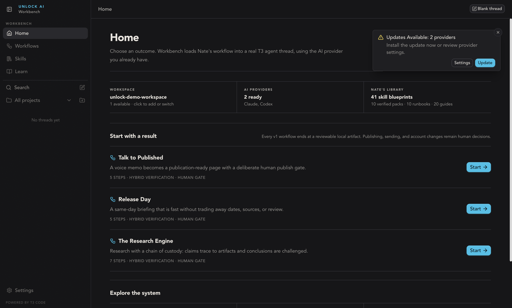
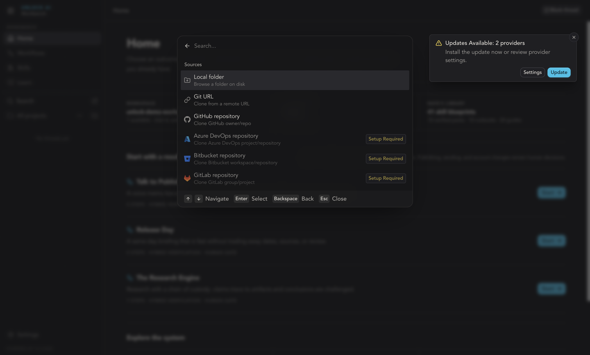
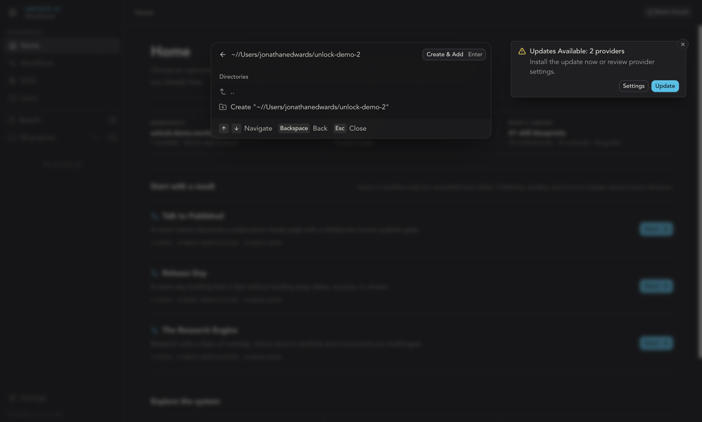
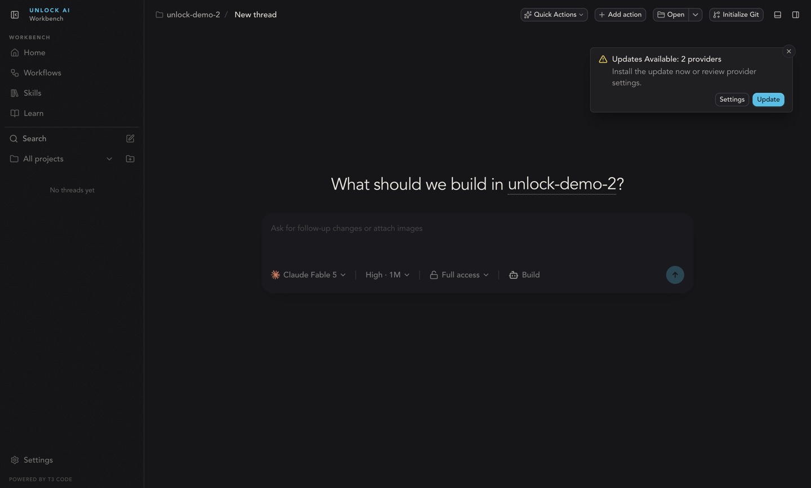
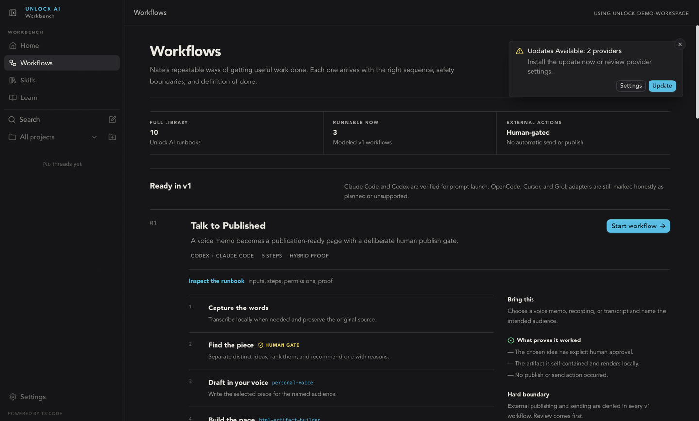
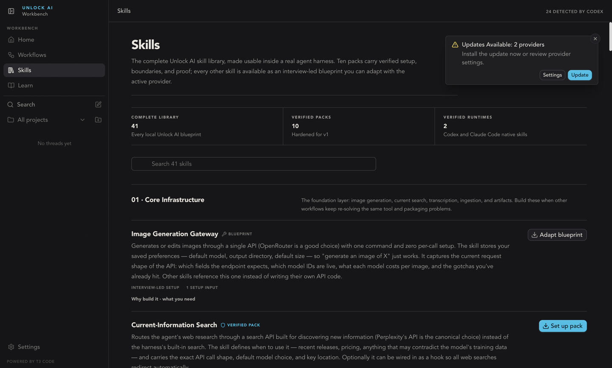
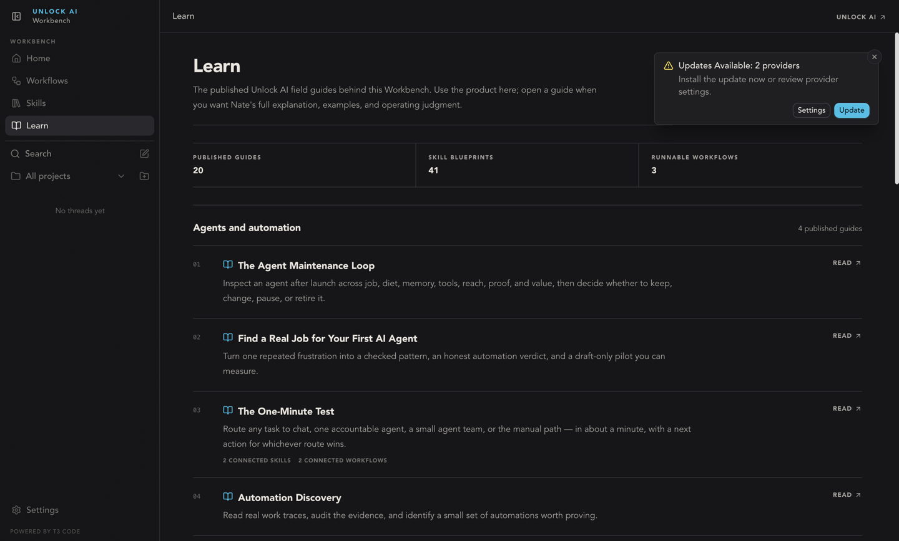
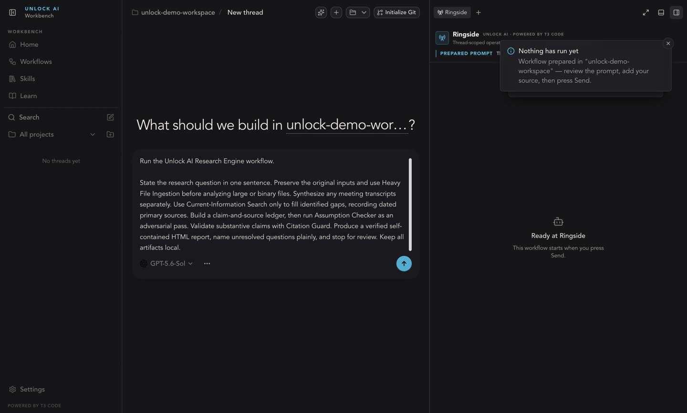
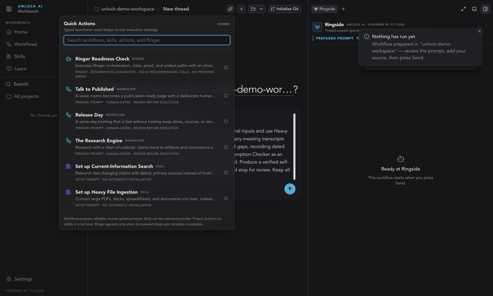
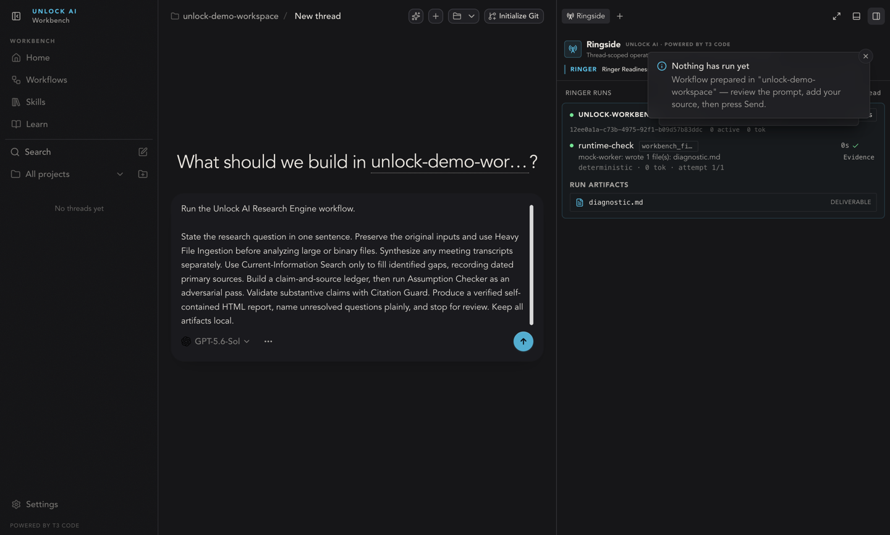

# A Visual Tour of Every Surface

This is the whole Workbench, one screen at a time, in the order you will meet them. Each screenshot comes with what you are looking at, what the states mean, and what to click next. For the hands-on version of the same path — with fix-it steps when something does not match — use [Getting started](./getting-started.md).

## Home

Home answers one question: are you ready to run something? The three tiles across the top are its status line.

- **Workspace** shows the project folder the Workbench is working in — the active folder's name and how many folders you have added. Click it to add or switch. Until you add a folder, workflows have nowhere to read or write.
- **AI Providers** shows how many provider logins were detected and are ready to use (here: "2 ready · Claude, Codex"). If it shows none ready, the Workbench has not found a logged-in provider — step 3 of [Getting started](./getting-started.md) covers the fix.
- **Nate's Library** counts what ships with the Workbench: skill blueprints, verified packs, runbooks, and guides. These numbers grow with updates, not with anything you do.

Below the tiles, **Start with a result** lists the three runnable workflows — **Talk to Published**, **Release Day**, and **The Research Engine** — each with its step count, verification style, and a human-gate marker. Press **Start** on any of them and the Workbench prepares a prompt for your review (see [Launching a workflow](#launching-a-workflow) below). The line above the cards is a promise the whole product keeps: every v1 workflow ends at a reviewable local artifact, and publishing, sending, and account changes remain human decisions.

When an update notice appears in the corner, **Update** installs it now; **Settings** lets you review provider settings first. Dismiss it with the × and it will not nag you mid-task.

## Adding your workspace folder

Click the **Workspace** tile on Home (or the add-folder icon beside **All projects** in the sidebar) and the source picker opens.

**Local folder** is the one you want for everyday use — it points the Workbench at a folder already on your Mac. The other entries clone a project from a hosting service; the ones marked **Setup Required** need credentials before they work. The picker is fully keyboard-driven: arrow keys to navigate, **Return** to select, **Esc** to close.

Choose **Local folder**, then type or paste a path. As you type, the picker lists matching folders so you can arrow down into them. If the folder does not exist yet, the picker offers to create it — press **Return** (**Create & Add**) and it is made and added in one step.

The folder opens immediately as a project with a fresh thread. The message composer at the center is where all work starts: type a request, or use **Quick Actions** in the header to launch something prepared. The row under the message box shows exactly what will answer you — the model, the effort and context setting, and the permission mode (**Full access** here; [Permission modes](./permission-modes.md) explains all four). **Initialize Git** in the header puts the folder under version control if you want checkpoints; it is optional.

## Workflows

Workflows are Nate's repeatable ways of getting useful work done — each arrives with the right sequence, safety boundaries, and a definition of done. The tiles set expectations honestly: the **full library** holds ten runbooks, **three** are modeled as runnable v1 workflows, and **external actions are human-gated** — no workflow sends or publishes automatically. The seven runbooks that are not yet runnable are planning blueprints: read them, borrow their structure, but there is no one-click launch. The note under **Ready in v1** is equally plain: Claude Code and Codex are verified for prompt launch; other adapters are marked as planned or unsupported rather than pretended.

Open **Inspect the runbook** on any card to see how a workflow is built:

- **Numbered steps** are the sequence the agent follows. A step tagged **Human gate** stops and waits for your explicit approval — the work does not continue past it on its own.
- **Skill chips** (like `personal-voice` on a draft step) name the skill that step relies on.
- **Bring this** tells you what to have ready before starting.
- **What proves it worked** is the checklist the run must satisfy — approval given, artifact renders locally, nothing published.
- **Hard boundary** states what is denied outright: external publishing and sending are refused in every v1 workflow. Review comes first.

**Start workflow** does the same thing as **Start** on Home: it prepares a prompt, it does not run anything yet.

## Skills

Skills is the complete Unlock AI skill library — 41 blueprints — made usable inside a real agent thread. Every entry is one of two kinds, and the badge next to its name tells you which:

- **Verified pack** — one of the ten hardened for v1, with explicit setup, boundaries, and proof. **Set up pack** launches a guided setup conversation with your active provider. Nothing installs silently: setup is a prompt you watch and approve, never an automatic installation.
- **Blueprint** — everything else in the library. **Adapt blueprint** starts an interview-led setup where the provider asks you for what it needs; the small chips say how many setup inputs to expect.

The badge in the top corner ("24 detected by Codex" here) is live: it counts the skills your active provider already has installed. An entry showing as installed or detected is already in that provider's toolkit — nothing to set up, just ask for it in a thread. Use the search box to filter all 41; they are grouped by layer, starting with core infrastructure the other skills build on.

## Learn

Learn is the bookshelf behind the product: the published Unlock AI field guides that the workflows and skills are built from. Use the product elsewhere in the app; come here when you want Nate's full explanation, examples, and operating judgment on a topic. Guides are grouped by theme, each entry opens the published guide with **Read**, and entries that connect to specific skills or workflows say so under the description. Nothing in Learn is required to run anything — it is context, on demand.

## Launching a workflow

This is what **Start** actually produces: a new thread with the workflow's full prompt sitting in the composer, unsent. The notice says it exactly — the workflow was prepared; review the prompt, add your source, then press **Send**. This is the human gate at the front of every workflow:

- **The prompt is plain, editable text.** Read it — it states the workflow's rules, including where it will stop for your review. Edit anything that does not fit your task, and attach or name the source material it should work from.
- **The model picker under the prompt** shows which provider model will run it. Change it before sending if you want a different one.
- **Ringside waits on the right.** "Ready at Ringside" means the panel is attached to this thread and will show execution live — but nothing runs and nothing is spent until you press **Send**.

## Quick Actions

**Quick Actions** in the thread header is the launcher for everything prepared. Every entry is typed, and the label after its name tells you exactly what launching it does — each type keeps its real execution strategy:

- **Workflow** — prepares an editable, human-gated prompt in the thread. You review before anything executes.
- **Skill** — prepares a setup prompt for the selected provider (shown in the top corner). No automatic installation.
- **Project action** — a command from your project that runs visibly in a terminal, where you can watch it.
- **Ringer** — the **Ringer Readiness Check**, a deterministic diagnostic of the multi-agent machinery. Its chips are the guarantee: no AI provider or model calls, no provider spend.

Search covers workflows, skills, actions, and Ringer at once; the star pins favorites to the top.

## Ringside

Ringside is the live view of agent and workflow execution, docked on the right of the thread that owns the work. This is what a passed Ringer Readiness Check looks like, top to bottom:

- **The run card** — a green state dot, the run's identifier, and its live totals: how many workers are active and how many tokens have been used. Here both are zero, and they stay zero: "no provider spend" is literal — the readiness check makes no provider or model calls, so it proves the machinery without costing anything.
- **The worker row** — the `runtime-check` worker reports what it actually did ("wrote 1 file(s): diagnostic.md"), that it ran deterministically at 0 tokens on attempt 1/1, and finishes with a check mark and **Evidence**: the verification was executed and inspected, not self-reported.
- **Run artifacts** — `diagnostic.md`, marked as the run's deliverable. Artifacts are real files in your workspace folder; open them like any other file.
- **Dismiss** a settled run to clear its card from the panel — the artifacts stay on disk.

During real multi-agent runs the same panel shows worker names, engines, models, attempts, and token usage as they happen. [Using Ringside](./ringside.md) is the full reference, including stopping a run.

## Where to go next

- [Getting started](./getting-started.md) — the same path, hands-on, with fixes for every "if not."
- [Permission modes](./permission-modes.md) — how much the agent does on its own before asking you.
- [Using Ringside](./ringside.md) — everything the panel shows during real runs.
